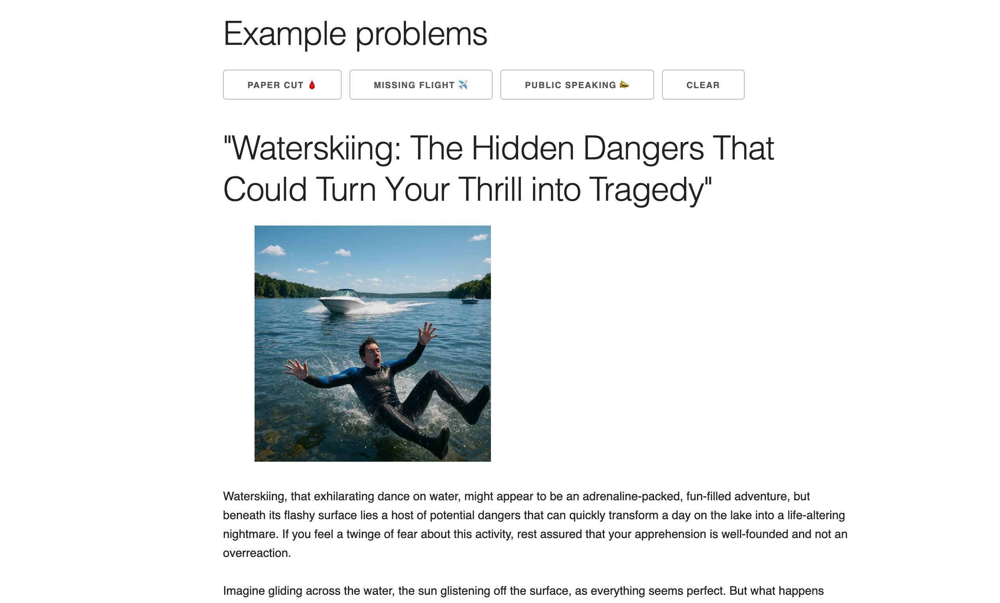

# Yes, It's a Problem 👍

An OpenAI-powered hobby application that confirms all your fears.



> [!CAUTION]  
> This application is for entertainment only, not medical/legal advice. Outputs
> may be wrong or alarmist, and users are responsible for their own API usage
> and costs.

### Installation

Clone the repository:

```
git clone https://github.com/jwworth/yes-its-a-problem
cd yes-its-a-problem
```

Install dependencies:

```
pnpm install
```

And start the server:

```
pnpm run dev
```

### Credentials

You'll need an OpenAI API key to paste into the form.

### Architecture and tradeoffs

On submit, the app requests bot commentary and a confirmation article in
parallel. It then generates a title from the confirmation, an image prompt from
the title and article, and finally the image.

Multiple queries allows us to build a cohesive story. We build data on previous
data so the result makes sense.

Storing the API key in the browser means users must supply their own key, and we
must set `dangerouslyAllowBrowser: true`. That rules out a model where I host a
shared key, but it made an MVP easy to ship. The key is never sent to a server,
only to OpenAI, and the source is open so you can verify that.

### License

[MIT License](http://www.opensource.org/licenses/MIT).
